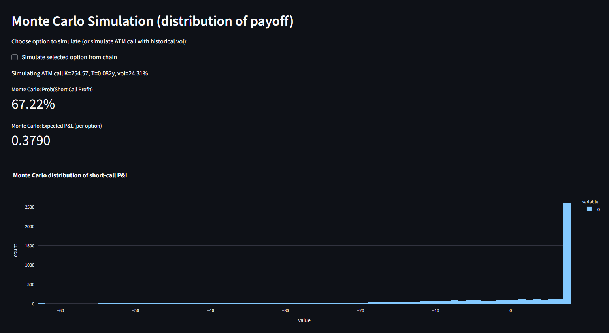

# Black-Scholes Pro Dashboard

A comprehensive web application for options pricing, implied volatility surface visualization, Greeks analysis, Monte Carlo simulation, and model-based historical backtesting using the Black-Scholes model. Built with Python, Streamlit, yfinance, and Plotly.

---

## Features

- **European Option Pricing**: Calculate call and put prices using the Black-Scholes formula.
- **Greeks Calculation**: Compute Delta, Gamma, Theta, Vega, and Rho for options.
- **Implied Volatility Surface**: Visualize IV across strikes and expiries from live option chain data.
- **Greeks Heatmap**: Visualize option sensitivities across the chain.
- **Short Call P&L Heatmap**: Analyze P&L for short call positions across price and volatility scenarios.
- **Monte Carlo Simulation**: Simulate option payoffs using Geometric Brownian Motion.
- **Model-Based Historical Backtest**: Backtest a monthly short-ATM-call strategy using historical realized volatility.
- **OpenAI GPT Assistant**: (Optional) Get explanations and quant guidance via GPT-4o-mini.

---

## Installation

1. **Clone or Download** this repository.
2. **Install dependencies** (preferably in a virtual environment):
   ```powershell
   pip install streamlit yfinance numpy pandas scipy plotly python-dotenv
   # Optional for AI assistant:
   pip install openai
   ```
3. **(Optional)** Create a `.env` file in the project root and add your OpenAI API key:
   ```env
   OPENAI_API_KEY=sk-...
   ```

---

## Usage

1. **Run the app:**
   ```powershell
   streamlit run app.py
   ```
2. **Open the web interface** in your browser (Streamlit will provide a local URL).
3. **Input a ticker** (e.g., `AAPL`) and adjust parameters in the sidebar.
4. **Explore:**
   - Market data and historical volatility
   - Option chain, IV surface, and Greeks
   - P&L heatmaps and Monte Carlo simulation
   - Model-based backtest of short call strategy
   - (Optional) Use the GPT Assistant for explanations

---

## File Structure

- `app.py` — Main Streamlit application
- `README.md` — Project documentation
- `.env` — (Optional) API keys for OpenAI

---

## Key Technologies
- **Python 3.7+**
- **Streamlit** — Interactive web UI
- **yfinance** — Market and option chain data
- **NumPy, Pandas, SciPy** — Numerics and data analysis
- **Plotly** — Interactive charts and heatmaps
- **OpenAI** — (Optional) GPT-based quant assistant

---

## Disclaimers & Notes
- This tool is for educational and decision-support use. It is *not* trading advice.
- Implied volatilities and Greeks are computed from available market data; yfinance may not always return all prices.
- Historical backtest is **model-based** (reconstructs option prices using Black–Scholes and realized volatility). For true historical option P/L, use a paid dataset.
- Monte Carlo uses Geometric Brownian Motion; for production, consider more advanced models.

---

## License
MIT License

---

## Acknowledgments
- [Streamlit](https://streamlit.io/)
- [yfinance](https://github.com/ranaroussi/yfinance)
- [Plotly](https://plotly.com/python/)
- [OpenAI](https://openai.com/)

---

## Example Screenshot



---

## Contact
For questions or suggestions, please open an issue or contact the author.
